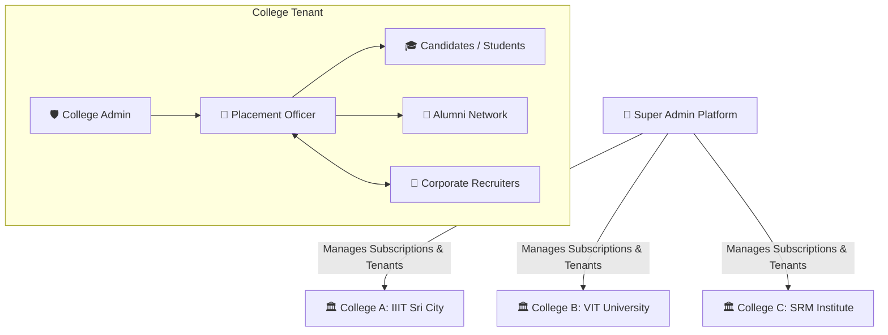

# 🎓 CareerNest — Campus Placement & Internship Management Portal

[](https://nestjs.com/)
[](https://www.typescriptlang.org/)
[](http://localhost:3000/api)
[](#system-architecture)
[](LICENSE)

> **CareerNest** is an enterprise-grade, multi-tenant B2B EdTech SaaS platform designed to streamline, automate, and bring complete transparency to college campus placements and internships. By replacing chaotic emails, manual spreadsheets, and fragmented messaging apps, CareerNest unites **Students (Candidates)**, **Recruiters**, **Alumni**, **Placement Officers (SPO)**, **College Admins**, and **Super Admins** into a unified, rule-governed ecosystem.

---

## 📑 Table of Contents

1. [Executive Summary & Problem Statement](#-executive-summary--problem-statement)
2. [Platform Architecture & Multi-Tenancy](#-platform-architecture--multi-tenancy)
3. [Admin Hierarchy & Governance Model](#-admin-hierarchy--governance-model)
4. [Revenue & Subscription Model](#-revenue--subscription-model)
5. [Actors & Role Responsibilities](#-actors--role-responsibilities)
6. [Comprehensive Feature Matrix by Actor](#-comprehensive-feature-matrix-by-actor)
   - [Candidate (Student) Portal](#1-candidate-student-portal)
   - [Recruiter Portal](#2-recruiter-portal)
   - [Senior Placement Officer (SPO) Portal](#3-senior-placement-officer-spo-portal)
   - [Alumni Portal](#4-alumni-portal)
   - [College Admin Portal](#5-college-admin-portal)
   - [Super Admin Platform Portal](#6-super-admin-platform-portal)
7. [Core Placement Workflows](#-core-placement-workflows)
8. [Database Schema & Data Model](#-database-schema--data-model)
9. [Technology Stack](#-technology-stack)
10. [REST API & Swagger Documentation](#-rest-api--swagger-documentation)
11. [Project Directory Structure](#-project-directory-structure)
12. [Installation, Setup & Running Guide](#-installation-setup--running-guide)
13. [Demo & Test Credentials](#-demo--test-credentials)

---

## 📌 Executive Summary & Problem Statement

### The Problem
Campus placement and internship drives are traditionally plagued by operational bottlenecks:
- **Zero Real-Time Visibility:** Students submit applications into black holes without knowing their screening or interview status.
- **Manual Eligibility Inefficiencies:** Placement coordinators manually filter spreadsheets of thousands of students against GPA, branch, and backlog criteria, causing errors and missed deadlines.
- **Disconnected Alumni Networks:** Referrals happen through ad-hoc personal channels without formal tracking or verified college affiliations.
- **Recruiter Friction:** Employers face delays coordinating with multiple college departments, receiving unverified student lists, and managing round logistics.
- **Institutional Administrative Overhead:** Placement cells lack centralized analytics, departmental comparisons, and historical hiring trends required for accreditation and institutional reporting.

### The CareerNest Solution
CareerNest models real-world hiring workflows with strict institutional governance:
- **Centralized Placement Repository:** Single source of truth for drives, resumes, eligibility, rounds, and outcomes.
- **Automated Eligibility Engine:** Instant matching against CGPA, allowed departments, batches, and active backlogs.
- **Formal Alumni Endorsement System:** Verified alumni referral requests with status tags visible to recruiters.
- **Multi-Tenant SaaS Scaling:** Seamless isolation between colleges with independent branding, administration, and tier-based feature access.
- **Actionable Intelligence:** Real-time dashboards, departmental placement analytics, offer yield calculations, and custom report builders.

---

## 🏛 Platform Architecture & Multi-Tenancy

CareerNest is built upon a **Multi-Tenant SaaS Architecture** where each educational institution operates as an isolated tenant with its own students, faculty officers, and placement records.



### Multi-Tenancy & Security Headers
Every authenticated client request passes headers to enforce tenant isolation and role permissions:
- `x-role`: Specifies the actor role (`super_admin`, `college_admin`, `placement_officer`, `recruiter`, `alumni`, `candidate`).
- `x-college-id`: Specifies the target tenant college ID (ensuring data cannot cross institutional boundaries).
- `x-user-id`: Identifies the individual actor for personalized tracking and audit logging.

---

## 👑 Admin Hierarchy & Governance Model

The platform enforces a structured **4-Tier Administrative Hierarchy** ensuring complete governance, data security, and operational clarity:

```
┌─────────────────────────────────────────────────────────────────────────────┐
│  LEVEL 1: SUPER ADMIN (Platform Master Administrator)                        │
│  - Universal system access & global oversight across all colleges           │
│  - College onboarding, suspension, activation, & status management          │
│  - Provisioning & lifecycle control of College Admin accounts               │
│  - Platform financial telemetry: Total MRR, ARR, & subscription tier stats  │
└──────────────────────────────────────┬──────────────────────────────────────┘
                                       │
                                       ▼
┌─────────────────────────────────────────────────────────────────────────────┐
│  LEVEL 2: COLLEGE ADMIN (Institutional Tenant Administrator)                 │
│  - Dedicated authority over a single college tenant                          │
│  - Placement Officer provisioning, assignment, and access control           │
│  - Student master directory oversight & batch verification                  │
│  - Subscription plan monitoring, feature matrix review & tier upgrade path   │
└──────────────────────────────────────┬──────────────────────────────────────┘
                                       │
                                       ▼
┌─────────────────────────────────────────────────────────────────────────────┐
│  LEVEL 3: SENIOR PLACEMENT OFFICER (SPO / T&P Cell Operations)               │
│  - Day-to-day placement operations & company engagement                     │
│  - Recruiter profile verification & approval / decline                      │
│  - Opportunity approval lifecycle: Pending ➔ Approved ➔ Published (Live)    │
│  - Placement drive coordination, interview scheduling, round results        │
│  - Bulk announcements & departmental placement reports                      │
└──────────────────────────────────────┬──────────────────────────────────────┘
                                       │
                                       ▼
┌─────────────────────────────────────────────────────────────────────────────┐
│  LEVEL 4: STAKEHOLDERS (End Users)                                          │
│  - Candidates (Students) │ Recruiters (Employers) │ Alumni Mentors          │
└─────────────────────────────────────────────────────────────────────────────┘
```

---

## 💰 Revenue & Subscription Model

CareerNest operates on a **Pure B2B Institutional SaaS Subscription Model**.

### Revenue Strategy & Philosophy
1. **Colleges Pay Subscriptions:** Colleges subscribe to monthly or annual plans based on their student cohort size and requirements for advanced placement intelligence and automation.
2. **Recruiters are 100% FREE:** Corporate hiring partners participate at **zero charge**. Removing financial barriers for recruiters maximizes campus hiring opportunities and ensures maximum student placements.
3. **Students & Alumni Access is FREE:** End users receive full access through their college's institutional subscription.

```
Total MRR = (Count_Basic × ₹15,000) + (Count_Standard × ₹30,000) + (Count_Premium × ₹50,000)
Total ARR = Total MRR × 12
```

### Subscription Tiers Breakdown

| Plan Tier | Monthly Fee | Annual Fee | Student Limit | Target Institution Profile |
| :--- | :--- | :--- | :--- | :--- |
| 🎓 **BASIC** | **₹15,000** / mo | ₹1,80,000 / yr | Up to 200 Students | Emerging colleges, regional institutes, or departments needing core placement digitization |
| ⭐ **STANDARD** | **₹30,000** / mo | ₹3,60,000 / yr | Up to 500 Students | Established engineering & management colleges requiring automation & advanced filtering |
| 👑 **PREMIUM** | **₹50,000** / mo | ₹6,00,000 / yr | **Unlimited** (99,999+) | Tier-1 universities, multi-department campuses needing real-time analytics & multi-officers |

### Subscription Feature Access Matrix

```
FEATURE / CAPABILITY                       BASIC (₹15k)     STANDARD (₹30k)    PREMIUM (₹50k)
─────────────────────────────────────────────────────────────────────────────────────────────
Student & Recruiter Management                  ✅                 ✅                 ✅
Placement Drive Posting & Applications          ✅                 ✅                 ✅
Automated Eligibility Checking                  ✅                 ✅                 ✅
Basic Reports & Statistics                      ✅                 ✅                 ✅
Core Alumni Referral Submissions                ✅                 ✅                 ✅
─────────────────────────────────────────────────────────────────────────────────────────────
Advanced Multi-Criteria Candidate Search        🔒 Locked          ✅                 ✅
Bulk Shortlisting & Round Status Updates        🔒 Locked          ✅                 ✅
Bulk Campus Notification Broadcasting           🔒 Locked          ✅                 ✅
Department-Wise Placement Analytics             🔒 Locked          ✅                 ✅
Interview Slot Scheduling & Booking             🔒 Locked          ✅                 ✅
Mentorship Hub & College Alumni Events          🔒 Locked          ✅                 ✅
Saved & Bookmarked Placement Drives             🔒 Locked          ✅                 ✅
─────────────────────────────────────────────────────────────────────────────────────────────
Real-Time Live Placement Dashboard              🔒 Locked          🔒 Locked          ✅
Custom Dynamic Report Builder                   🔒 Locked          🔒 Locked          ✅
Multi-Placement Officer Delegation              🔒 Locked          🔒 Locked          ✅
Searchable Alumni Directory & Mentee Tracking   🔒 Locked          🔒 Locked          ✅
Hiring Pipeline & Funnel Reports                🔒 Locked          🔒 Locked          ✅
Application Stage Timeline & Calendar           🔒 Locked          🔒 Locked          ✅
```

> **Dynamic Feature Locking:** When an institution is on a lower tier, premium routes return HTTP 403 `SUBSCRIPTION_REQUIRED` and the frontend UI gracefully displays blurred cards with plan upgrade badges and direct upgrade prompts.

---

## 👥 Actors & Role Responsibilities

### 1. Candidate (Student)
- **Profile Management:** Maintains verified academic profile, CGPA, department, roll number, active backlogs, skills, portfolio links, and uploaded resumes.
- **Opportunity Discovery:** Browses published full-time jobs and internships tailored to their college.
- **Eligibility Validation:** Real-time validation checks against drive eligibility criteria before application submission.
- **Application Submission:** Applies to eligible opportunities and tracks status through every recruitment stage.
- **Alumni Referral Requests:** Identifies alumni working at target companies and submits formal referral requests.
- **Interview Coordination:** Views scheduled assessments, technical interviews, meeting links, and outcomes.

### 2. Recruiter (Corporate Hiring Partner)
- **Opportunity Submission:** Creates and posts detailed job/internship profiles including stipend/CTC, job description, deadline, and eligibility rules.
- **Candidate Evaluation:** Accesses applicant profiles, resumes, and verified academic credentials.
- **Referral Indicators:** Visual indicators identifying candidates backed by verified alumni endorsements.
- **Round Management:** Conducts multi-stage selection rounds (Online Assessments, Technical Interviews, HR Rounds).
- **Candidate Shortlisting:** Shortlists, selects, or rejects candidates individually or in bulk.
- **Hiring Reports:** Generates recruitment yield reports and hiring analytics per drive.

### 3. Alumni (Graduate Network)
- **Referral Governance:** Reviews candidate profiles and approves or declines referral requests with personal notes.
- **Mentorship Hub:** Mentors current students on career paths, resume reviews, and interview strategies.
- **Alumni Directory:** Connects with graduates across batches, companies, and locations.
- **College Events:** Participates in alumni reunions, guest lectures, and recruitment webinars.
- **Impact Tracking:** Tracks personal contribution scores and total students successfully placed via referrals.

### 4. Senior Placement Officer (SPO / T&P Cell)
- **Recruiter Onboarding:** Reviews and approves corporate recruiter accounts and company credentials.
- **Opportunity Approval Workflow:** Vets job postings (`Pending ➔ Approved ➔ Published`).
- **Campus-Wide Coordination:** Organizes placement schedules, assessment venues, and recruiter communications.
- **Broadcast Communications:** Dispatches bulk notifications to candidates, alumni, or recruiters.
- **Institutional Analytics:** Evaluates department-level placement rates, average/highest packages, and annual placement reports.

### 5. College Admin (Institutional Governance)
- **Officer Management:** Assigns and manages placement officers for the institution.
- **Student Master Records:** Oversees student directories and batch records.
- **Subscription Lifecycle:** Monitors the college's active plan, student usage limits, and initiates tier upgrades.

### 6. Super Admin (Platform Administration)
- **Platform Telemetry:** Monitors platform-wide student counts, placements, active colleges, and system health.
- **Tenant Lifecycle:** Creates, edits, activates, suspends, or deletes colleges.
- **Account Provisioning:** Creates and assigns College Admin credentials.
- **Financial Analytics:** Live dashboard of platform MRR, ARR, plan distribution, and top college accounts.

---

## ⚡ Comprehensive Feature Matrix by Actor

### 1. Candidate (Student) Portal
*Path: `frontend/Candidate/html/`*

| Page / Module | File Path | Plan Required | Description & Capabilities |
| :--- | :--- | :---: | :--- |
| **Dashboard** | `Candidate/html/index.html` | Basic | Overview of active drives, application counts, upcoming deadlines, and quick navigation. |
| **Opportunities** | `Candidate/html/opportunities.html` | Basic | Complete catalog of published campus drives with eligibility badges and one-click application. |
| **My Applications** | `Candidate/html/applications.html` | Basic | Full tracking of submitted applications with status badges (`Applied`, `Shortlisted`, `Interview`, `Selected`, `Rejected`). |
| **Referrals Hub** | `Candidate/html/referrals.html` | Basic | Request endorsements from company-specific alumni and track referral status. |
| **Candidate Profile** | `Candidate/html/profile.html` | Basic | Manage skills, resume URL, academic background, CGPA, backlogs, and contact info. |
| **Security / Password** | `Candidate/html/changepassword.html` | Basic | Update credentials and account security settings. |
| **Advanced Drive Search** | `Candidate/html/advanced-search.html` | Standard | Multi-criteria search by job role, minimum package, location, and hiring type. |
| **Saved / Bookmarked Drives** | `Candidate/html/saved-drives.html` | Standard | Bookmark high-priority drives for rapid tracking and deadline reminders. |
| **Application Tracking Timeline** | `Candidate/html/application-tracking.html` | Premium | Step-by-step visual hiring pipeline timeline from initial screening to final offer letter. |
| **Interview Calendar** | `Candidate/html/interviews.html` | Premium | Integrated calendar showing upcoming assessments, technical interviews, and meeting links. |

---

### 2. Recruiter Portal
*Path: `frontend/Recruiter/pages/`*

| Page / Module | File Path | Plan Required | Description & Capabilities |
| :--- | :--- | :---: | :--- |
| **Recruiter Dashboard** | `Recruiter/pages/index.html` | Basic | Summary of active job posts, pending applicants, scheduled rounds, and company stats. |
| **Post Opportunity** | `Recruiter/pages/post.html` | Basic | Create job/internship listings with role details, salary/stipend, deadlines, and eligibility criteria. |
| **My Opportunities** | `Recruiter/pages/myopportunities.html` | Basic | Edit, manage, and track approval status of all company-posted opportunities. |
| **Candidate Applications** | `Recruiter/pages/applications.html` | Basic | Review incoming candidate resumes, view alumni endorsement tags, and update candidate stages. |
| **Assessments & Rounds** | `Recruiter/pages/assessments.html` | Basic | Configure recruitment rounds (Coding tests, Group discussions, Technical/HR interviews). |
| **Company Profile** | `Recruiter/pages/profile.html` | Basic | Company branding, designation, website, and recruiter contact details. |
| **Candidate Search & Filter** | `Recruiter/pages/candidates-filter.html` | Standard | Deep candidate search by CGPA threshold, department, graduation year, and zero-backlog filters. |
| **Bulk Candidate Shortlist** | `Recruiter/pages/candidates-filter.html` | Standard | Batch-action toolbar to shortlist or reject dozens of applicants simultaneously. |
| **Drive Hiring Reports** | `Recruiter/pages/hiring-report.html` | Premium | Comprehensive recruitment funnel analytics, offer acceptance rates, and candidate conversion stats. |

---

### 3. Senior Placement Officer (SPO) Portal
*Path: `frontend/placement total final/pages/`*

| Page / Module | File Path | Plan Required | Description & Capabilities |
| :--- | :--- | :---: | :--- |
| **SPO Dashboard** | `placement total final/pages/p1.html` | Basic | College-wide placement pulse, live drive tally, placed student counter, and recent activities. |
| **Opportunity Review & Approval**| `placement total final/pages/p2.html` | Basic | Multi-step review workflow: Inspect recruiter submissions, verify criteria, approve/reject with remarks, and publish live. |
| **Recruiter Management** | `placement total final/pages/p3.html` | Basic | Approve new recruiter registrations, verify corporate credentials, or decline unverified accounts. |
| **Student Directory** | `placement total final/pages/p4.html` | Basic | Centralized student roster with CGPA, department filters, and placement status tracking. |
| **Alumni Governance** | `placement total final/pages/p5.html` | Basic | Alumni network overview, referral activity monitoring, and endorsement audits. |
| **Placement Cell Settings** | `placement total final/pages/p6.html` | Basic | College profile, academic calendar settings, and institutional configuration. |
| **Bulk Notifications** | `placement total final/pages/bulk-notify.html` | Standard | Broadcast targeted email/push notifications to candidates, alumni, or recruiters. |
| **Multi-Criteria Search** | `placement total final/pages/candidates-filter.html` | Standard | Advanced candidate filtering for targeted shortlisting and recruiter requirements. |
| **Department Reports** | `placement total final/pages/dept-report.html` | Standard | Department-wise placement breakdown, branch conversion rates, and package averages. |
| **Live Placement Dashboard** | `placement total final/pages/placement-dashboard.html` | Premium | Real-time live metrics dashboard, package distributions, target tracking, and dynamic report exports. |

---

### 4. Alumni Portal
*Path: `frontend/Alumni Final/pages/`*

| Page / Module | File Path | Plan Required | Description & Capabilities |
| :--- | :--- | :---: | :--- |
| **Alumni Dashboard** | `Alumni Final/pages/A1.html` | Basic | Overview of incoming referral requests, college news, and professional profile summary. |
| **Referral Requests** | `Alumni Final/pages/A2.html` | Basic | Review student profiles, inspect resumes, and approve or decline referrals with personalized feedback. |
| **Alumni Profile** | `Alumni Final/pages/A3.html` | Basic | Manage current company, designation, graduation batch, work experience, and contact details. |
| **Mentorship Hub** | `Alumni Final/pages/mentorship.html` | Standard | Accept mentorship requests from students, schedule guidance sessions, and track mentee progress. |
| **College Events** | `Alumni Final/pages/events.html` | Standard | Browse and register for college networking events, webinars, hackathons, and reunions. |
| **Alumni Directory** | `Alumni Final/pages/directory.html` | Premium | Searchable alumni directory filtered by company (Google, Microsoft, Amazon, etc.), batch, and department. |

---

### 5. College Admin Portal
*Path: `frontend/college-admin/`*

| Page / Module | File Path | Plan Required | Description & Capabilities |
| :--- | :--- | :---: | :--- |
| **College Overview** | `college-admin/index.html` | Basic | Institutional summary: Student counts, placement rates, active officers, and subscription badge. |
| **Placement Officers** | `college-admin/officers.html` | Basic | Create, assign, view, and toggle active/inactive status of institutional Placement Officers. |
| **Student Directory** | `college-admin/students.html` | Basic | Full institutional student master list, batch distributions, and academic standing. |
| **Subscription & Upgrade** | `college-admin/subscription.html` | Basic | Detailed plan matrix, allowed vs locked feature breakdown, usage limits, and tier upgrade actions. |

---

### 6. Super Admin Platform Portal
*Path: `frontend/super-admin/`*

| Page / Module | File Path | Plan Required | Description & Capabilities |
| :--- | :--- | :---: | :--- |
| **Platform Dashboard** | `super-admin/index.html` | Super Admin | Cross-platform metrics: Total colleges, active subscriptions, total placed students, and SaaS MRR/ARR analytics. |
| **College Management** | `super-admin/colleges.html` | Super Admin | Complete college CRUD: Onboard new colleges, modify subscription tier (`Basic`, `Standard`, `Premium`), suspend/activate tenants. |
| **College Admin Control** | `super-admin/college-admin.html`| Super Admin | Provision, configure, and manage administrative credentials for all college admins. |

---


### Key Relational Tables:
1. **`Users`**: Core authentication table (`user_id`, `name`, `email`, `password`, `role`).
2. **`Candidate`**: Academic profile (`candidate_id`, `user_id`, `branch_id`, `cgpa`, `graduation_year`).
3. **`Recruiter`**: Company representative profile (`recruiter_id`, `user_id`, `company_id`, `recruiter_designation`).
4. **`Alumni`**: Graduate record (`alumni_id`, `user_id`, `company_id`, `designation`, `graduation_year`).
5. **`PlacementOfficer`**: Faculty placement coordinator profile (`officer_id`, `user_id`).
6. **`Company`**: Corporate profiles (`company_id`, `company_name`, `industry`, `location`, `website`).
7. **`Opportunity`**: Placement drive listings (`opportunity_id`, `recruiter_id`, `company_id`, `title`, `opp_type`, `salary`, `deadline`, `approval_status`).
8. **`EligibilityCriteria`**: Rules engine (`eligibility_id`, `opportunity_id`, `min_cgpa`).
9. **`EligibilityBranch` & `EligibilityBatch`**: Many-to-many branch/batch eligibility mapping.
10. **`Application`**: Candidate job submissions (`application_id`, `candidate_id`, `opportunity_id`, `app_status`, `resume_id`).
11. **`RecruitmentRound`**: Selection stages (`round_id`, `opportunity_id`, `round_type`, `round_date`, `meeting_link`).
12. **`RoundResult`**: Individual student performance per round (`result_id`, `round_id`, `application_id`, `round_status`).
13. **`Referral`**: Alumni recommendations (`referral_id`, `candidate_id`, `alumni_id`, `opportunity_id`, `ref_status`).
14. **`Notification`**: Broadcast and direct user alert notifications.

---

## 🛠 Technology Stack

### Backend
- **Framework:** [NestJS v11](https://nestjs.com/) (Progressive Node.js TypeScript Framework)
- **Language:** TypeScript 5.3+
- **API Protocol:** RESTful Architecture with standard JSON payloads
- **Documentation:** Swagger / OpenAPI 3.0 via `@nestjs/swagger`
- **Validation:** `class-validator` and `class-transformer` pipes
- **File Uploads:** Multer with secure extension and size limits
- **Logging:** Custom `LoggerMiddleware` and `LogFileService` with daily disk rotation
- **Security:** `SecurityMiddleware` (rate limiting, security headers) and `RolesGuard` RBAC

### Frontend
- **Interface:** Modern Vanilla HTML5, ES6+ Modules, and Modular CSS3
- **Design System:** Clean responsive layout, CSS variables, dark/light theme switching, and interactive charts
- **Client Networking:** Centralized `api.js` client with multi-tenant header management
- **Feature Gating Engine:** `subscription.js` modular feature-locking and upgrade engine
- **UI Prototypes:** Full visual designs documented in Figma prototype links

---

## 📖 REST API & Swagger Documentation

When the backend is running, the interactive Swagger documentation is accessible at:
👉 **`http://localhost:3000/api`**

### Summary of Key API Endpoints

```
MODULE             METHOD    ENDPOINT                                DESCRIPTION
──────────────────────────────────────────────────────────────────────────────────────────────────
Auth & Users       POST      /users/login                            Authenticate & retrieve role context
                   GET       /users                                  List users (role/college scoped)
                   GET       /users/:id                              Get individual user profile
                   PUT       /users/:id                              Update user profile
                   POST      /users/:id/profile-picture              Upload profile picture (multipart)

Opportunities      GET       /opportunities                          List live (students) or all drives
                   POST      /opportunities                          Create new drive (Recruiter/SPO)
                   PATCH     /opportunities/:id/approve              Approve pending drive (SPO)
                   PATCH     /opportunities/:id/publish              Publish approved drive live (SPO)
                   PATCH     /opportunities/:id/reject               Reject drive with remarks (SPO)

Applications       GET       /applications                           List applications for drive
                   GET       /applications/my                        Get student's applications
                   POST      /applications                           Submit application (Candidate)
                   PATCH     /applications/:id/status                Update candidate status
                   PATCH     /applications/:id/withdraw              Withdraw application

Referrals          GET       /referrals                              List referrals for alumni
                   GET       /referrals/my                           Get student's referral requests
                   POST      /referrals                              Submit referral request (Candidate)
                   PATCH     /referrals/:id                          Approve/decline referral (Alumni)

Colleges           GET       /colleges                               List all colleges
                   GET       /colleges/:id/subscription              Get tier, allowed & locked features
                   POST      /colleges                               Create new college (Super Admin)
                   PATCH     /colleges/:id/status                    Update status (Active/Suspended)

Super Admin        GET       /super-admin/stats                      Platform-wide aggregate telemetry
                   GET       /super-admin/revenue                    MRR, ARR, & subscription analytics
                   GET       /super-admin/colleges                   Colleges with stats & admins
                   POST      /super-admin/colleges/:id/admin         Provision College Admin account
                   PATCH     /super-admin/colleges/:id/subscription  Modify college subscription tier

Features (Tiered)  GET       /features/candidate/drives/search       [Standard] Multi-filter drive search
                   GET       /features/candidate/saved-drives        [Standard] Get bookmarked drives
                   GET       /features/candidate/interviews          [Premium] Interview calendar schedule
                   POST      /features/recruiter/drives/bulk-shortlist [Standard] Bulk shortlist applicants
                   GET       /features/recruiter/reports             [Premium] Drive hiring funnel analytics
                   POST      /features/officer/notifications/bulk    [Standard] Broadcast bulk alerts
                   GET       /features/officer/dept-report           [Standard] Department analytics
                   GET       /features/officer/placement-dashboard   [Premium] Real-time live dashboard
                   GET       /features/alumni/directory              [Premium] Searchable alumni directory
```

---

## 📂 Project Directory Structure

```
5_CareerNest/
├── DataBase/
│   ├── DBSchema.sql               # MySQL/PostgreSQL relational database schema
│   ├── CareerNest DB Design.pdf   # Complete database architecture documentation
│   └── ER_Diagram.pdf             # Entity-Relationship diagram
├── Figma Designs/
│   └── Designs.md                 # UI/UX design prototype links & overview
├── DomainExpertInteraction.md     # Domain research, workflows, & field expert interview
├── definitions.yml                # Standardized domain ontology & terminology dictionary
├── backend/                       # NestJS v11 TypeScript Server
│   ├── docs/
│   │   └── swagger.json           # OpenAPI 3.0 API specifications
│   ├── src/
│   │   ├── main.ts                # Application entry point & Swagger bootstrapper
│   │   ├── app.module.ts          # Root module & middleware pipeline wiring
│   │   ├── common/
│   │   │   ├── decorators/        # @Roles() and @CurrentUser() decorators
│   │   │   ├── guards/            # RolesGuard RBAC & tenant enforcer
│   │   │   ├── middleware/        # Security, FileUpload, & Logger middleware
│   │   │   └── filters/           # Global exception filter with disk logging
│   │   ├── users/                 # User management & authentication
│   │   ├── opportunities/         # Job & internship postings lifecycle
│   │   ├── applications/          # Student applications & stage progression
│   │   ├── referrals/             # Alumni endorsement system
│   │   ├── assessments/           # Recruitment rounds & test schedules
│   │   ├── notifications/         # Notification dispatches
│   │   ├── recruiters/            # Recruiter verification & management
│   │   ├── colleges/              # College tenants & subscription definitions
│   │   ├── super-admin/           # Platform analytics & revenue telemetry
│   │   └── features/              # Tier-gated features (Standard & Premium)
│   └── package.json
└── frontend/                      # Web Portals & UI Engine
    ├── index.html                 # Public landing page with pricing & role overviews
    ├── login.html                 # Unified role-based login portal
    ├── contact.html               # Support & inquiry page
    ├── api.js                     # Centralized API network client
    ├── subscription.js            # Frontend feature-gating & upgrade banner engine
    ├── Candidate/html/            # Candidate (Student) portal pages
    ├── Recruiter/pages/           # Recruiter portal pages
    ├── Alumni Final/pages/        # Alumni endorsement & mentoring portal pages
    ├── placement total final/     # Senior Placement Officer (SPO) portal pages
    ├── college-admin/             # College Admin governance portal pages
    └── super-admin/               # Super Admin platform & revenue portal pages
```

---

## 🚀 Installation, Setup & Running Guide

### Prerequisites
- **Node.js**: v18.0.0 or higher ([Download Node.js](https://nodejs.org/))
- **npm**: v9.0.0 or higher
- **Web Browser**: Chrome, Edge, Firefox, or Safari

---

### Step 1: Clone the Repository
```bash
git clone https://github.com/saiganas/5_CareerNest.git
cd 5_CareerNest
```

---

### Step 2: Set Up & Run the Backend API

```bash
# Navigate to the backend directory
cd backend

# Install dependencies
npm install

# Start the NestJS development server
npm run start:dev
```

The backend server will start on:
- 🚀 **API Server:** `http://localhost:3000`
- 📖 **Interactive Swagger Docs:** `http://localhost:3000/api`

---

### Step 3: Run the Frontend Portals

The frontend consists of static web pages that connect to the backend API. You can serve them using any HTTP server:

#### Option A: Using VS Code Live Server (Recommended)
1. Open the project root in **VS Code**.
2. Right-click `frontend/index.html` and select **"Open with Live Server"**.

#### Option B: Using `http-server` or `serve`
```bash
# From the project root:
cd frontend
npx serve -l 5500
```
Then navigate to `http://localhost:5500` in your web browser.

---

## 🔑 Demo & Test Credentials & Tier Access Matrix

All pre-configured demo and testing accounts use the default password: **`123`**

### 📊 Full Actor Subscription & Feature Gating Matrix

The following table details every test account across each role and subscription tier, including exact counts of **Allowed (Unlocked)** and **Locked** features:

| Actor / Role | Subscription Tier (Price) | Login Email | Allowed Features | Locked Features |
| :--- | :--- | :--- | :---: | :---: |
| 🎓 **Candidate** | **Basic** (₹15k/mo) | `student@basiccollege.in` | **7** | 10 |
| 🎓 **Candidate** | **Standard** (₹30k/mo) | `student@standardcollege.in` | **13** | 4 |
| 🎓 **Candidate** | **Premium** (₹50k/mo) | `student@premiumcollege.in` / `c@gmail.com` | **17** | **0 (All Unlocked)** |
| 🏢 **Recruiter** | **Basic** (₹15k/mo) | `recruiter@basiccollege.in` | **6** | 9 |
| 🏢 **Recruiter** | **Standard** (₹30k/mo) | `recruiter@standardcollege.in` | **11** | 4 |
| 🏢 **Recruiter** | **Premium** (₹50k/mo) | `recruiter@premiumcollege.in` / `r@gmail.com` | **15** | **0 (All Unlocked)** |
| 👔 **Placement Officer** | **Basic** (₹15k/mo) | `placement@basiccollege.in` *(or officer@)* | **6** | 9 |
| 👔 **Placement Officer** | **Standard** (₹30k/mo) | `placement@standardcollege.in` *(or officer@)* | **11** | 4 |
| 👔 **Placement Officer** | **Premium** (₹50k/mo) | `placement@premiumcollege.in` / `p@gmail.com` | **15** | **0 (All Unlocked)** |
| 🤝 **Alumni** | **Basic** (₹15k/mo) | `alumni@basiccollege.in` | **5** | 9 |
| 🤝 **Alumni** | **Standard** (₹30k/mo) | `alumni@standardcollege.in` | **10** | 4 |
| 🤝 **Alumni** | **Premium** (₹50k/mo) | `alumni@premiumcollege.in` / `a@gmail.com` | **14** | **0 (All Unlocked)** |
| 🛡️ **College Admin** | **Basic** (₹15k/mo) | `admin@basiccollege.in` | **4** | 6 |
| 🛡️ **College Admin** | **Standard** (₹30k/mo) | `admin@standardcollege.in` | **7** | 3 |
| 🛡️ **College Admin** | **Premium** (₹50k/mo) | `admin@premiumcollege.in` / `ca@iiit.in` | **10** | **0 (All Unlocked)** |
| 👑 **Super Admin** | **Platform Master** | `superadmin@platform.com` | **All Platform Modules** | **0 (All Unlocked)** |


---
